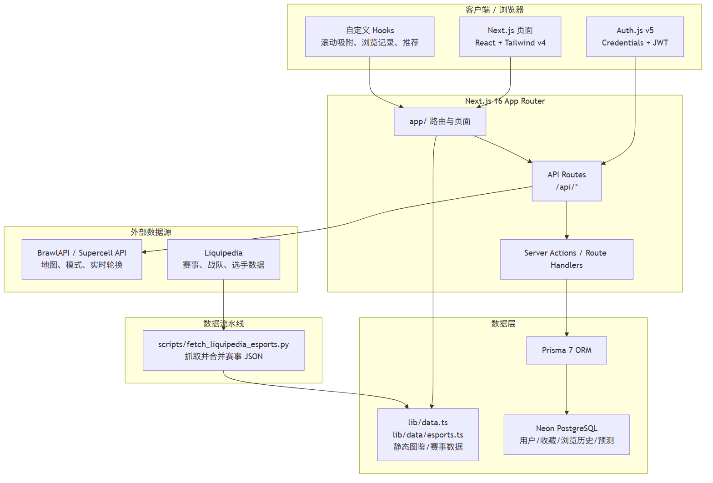
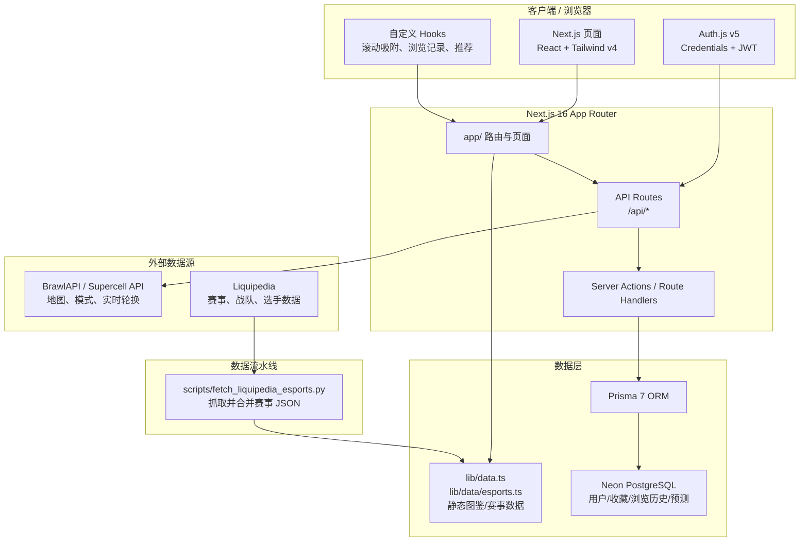

# 荒野乱斗资料站（Brawl Stars Showcase）

一个以 Supercell 手游《荒野乱斗》（Brawl Stars）为主题的资料展示站点，面向中文玩家，定位为“图鉴 + 赛事”中心。

在线地址：https://brawlstars-showcase.vercel.app/

---

## 主要功能

- **英雄图鉴**：104 位英雄列表、分类筛选、英雄详情页（属性、普攻、大招、星辉、妙具、装备、极限充能、皮肤、背景故事）。
- **对战地图**：地图列表、按模式/实时天梯池筛选、地图收藏与推荐。
- **游戏模式**：模式卡片、实时轮换倒计时、模式详情页。
- **赛事中心**：赛事列表、战队/选手档案、赛程日历、数据统计、淘汰赛进程树（含 2025 Brawl Cup 自定义对阵图）。
- **用户系统**：注册登录、英雄/地图/赛事收藏、浏览历史、个人分享卡片。
- **个性化推荐**：基于用户收藏分布的轮询推荐算法，避免只推荐单一类别。

---

## 技术栈

| 层级 | 技术 |
|------|------|
| 前端框架 | Next.js 16.2.6（App Router） |
| UI 库 | React 19.2.4 |
| 语言 | TypeScript 5 |
| 样式 | Tailwind CSS v4 |
| 认证 | Auth.js v5 beta（Credentials + JWT） |
| ORM | Prisma 7.8.0 |
| 数据库 | Neon PostgreSQL |
| 数据抓取 | Python 3 + Requests + BeautifulSoup |
| 包管理 | npm |
| 部署 | Vercel |

---

## 数据库设计

核心表结构（Prisma Schema）定义在 `prisma/schema.prisma`：

- **`User`**：用户基础信息、自定义昵称/头像、认证凭证（Auth.js Credentials 与 OAuth 兼容）。
- **`Account` / `Session` / `VerificationToken`**：Auth.js v5 标准会话与 OAuth 账户表。
- **`FavoriteMap` / `FavoriteHero` / `FavoritePin`**：用户收藏（地图、英雄、表情），通过 `@@unique([userId, itemId])` 联合唯一约束实现幂等收藏。
- **`ViewHistory`**：浏览历史记录，记录 `itemType` + `itemId` + 时间戳，支撑“最近浏览”与个性化推荐。
- **`FollowedTeam` / `FollowedPlayer` / `EventFavorite`**：赛事关注与收藏，支持战队、选手、比赛三种维度。
- **`Prediction`**：赛事胜负预测，记录预测方、实际结果与是否正确，用于计算用户预测准确率。

设计要点：

- 用户行为表与内容表解耦，不直接存储外部内容详情，仅保存业务主键（如 `mapName`、`heroId`、`matchId`），避免数据冗余。
- 高频查询均建立联合索引，例如 `@@index([userId, viewedAt])`、`@@unique([userId, itemType, itemId])`。
- 使用 Prisma Migration 管理 Schema 版本，本地 `migrate dev`、生产 `migrate deploy`。

---

## 数据流水线（Python）

`scripts/fetch_liquipedia_esports.py`：Liquipedia 赛事数据 ETL 脚本

- **抓取（Extract）**：请求 Liquipedia 赛事/战队/选手页面，解析 HTML 与模块数据。
- **清洗（Transform）**：
  - 去重：基于赛事 ID、战队名称、选手 ID 进行全局去重；
  - 格式标准化：统一赛区命名、时间格式、比分字段；
  - 缺失值处理：对空字段填充默认值并记录日志。
- **加载（Load）**：输出结构化 JSON（`lib/data/liquipediaTournaments.json`、`liquipediaTeams.json`、`liquipediaPlayers.json`），供前端静态渲染与 API 调用。
- **增量更新**：通过文件哈希与更新时间戳判断是否需要重新抓取，避免重复请求 Liquipedia 导致限流。

---

## API 接口

| 路径 | 方法 | 说明 |
|------|------|------|
| `/api/brawl-data` | GET | 代理 Supercell API，返回地图/模式静态数据（服务端缓存 60s） |
| `/api/rotation` | GET | 实时游戏模式轮换数据（服务端缓存 5min） |
| `/api/ranked-maps` | GET | 当前天梯地图池数据 |
| `/api/auth/register` | POST | 邮箱注册，bcryptjs 密码哈希 |
| `/api/auth/[...nextauth]` | GET/POST | Auth.js 认证回调（登录/登出/会话） |
| `/api/user/favorites` | GET/POST/DELETE | 用户地图收藏管理（需认证） |
| `/api/user/heroes` | GET/POST/DELETE | 用户英雄收藏管理（需认证） |
| `/api/user/pins` | GET/POST/DELETE | 用户表情收藏管理（需认证） |
| `/api/user/views` | GET/POST/DELETE | 用户浏览历史管理（需认证） |
| `/api/user/profile` | GET/PATCH | 用户资料查询与更新（昵称、头像）（需认证） |
| `/api/user/follows/teams` | GET/POST/DELETE | 关注/取消关注战队（需认证） |
| `/api/user/follows/players` | GET/POST/DELETE | 关注/取消关注选手（需认证） |
| `/api/user/favorites/events` | GET/POST/DELETE | 赛事内容收藏（战队/选手/比赛）（需认证） |
| `/api/user/predictions` | GET/POST | 提交/查询赛事胜负预测（需认证） |

---

## 环境变量

复制 `.env.local.example` 为 `.env.local` 并填写：

```bash
DATABASE_URL="postgresql://..."
AUTH_SECRET="your-auth-secret"
BRAWL_API_TOKEN="your-brawlstars-api-token"  # 可选，用于实时地图/赛事数据
```

---

## 本地开发

```bash
# 安装依赖
npm install

# 生成 Prisma Client
npx prisma generate

# 启动开发服务器
npm run dev
```

访问 http://localhost:3000。

---

## 构建与部署

```bash
npm run build
npm run start
```

项目已配置 Vercel 构建命令 `prisma generate && next build`，每次部署会自动生成 Prisma Client。

---

## 数据来源

- 英雄/地图/模式数据：BrawlAPI / Supercell 官方 API（通过 `/api/brawl-data`、`/api/rotation` 代理）。
- 赛事数据：Liquipedia（通过 `scripts/fetch_liquipedia_esports.py` 抓取并合并）。

---

## 项目架构图



<details>
<summary>点击查看 Mermaid 源码（备用）</summary>



</details>

---

## 项目结构

```
app/                  # Next.js App Router 页面与 API
components/           # React 组件
hooks/                # 自定义 Hooks
lib/                  # 数据、工具函数
prisma/               # Prisma schema 与迁移
public/               # 静态资源
scripts/              # 数据抓取脚本
```

---

## 课程信息

- 课程名称：Web 应用开发技术
- 项目类型：课程项目
- 本人职责：独立完成全栈架构设计、数据库建模、API 开发、Python 数据抓取脚本编写与 Vercel 部署运维
